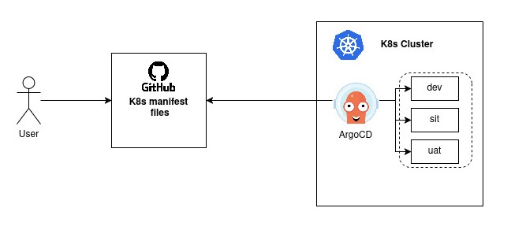
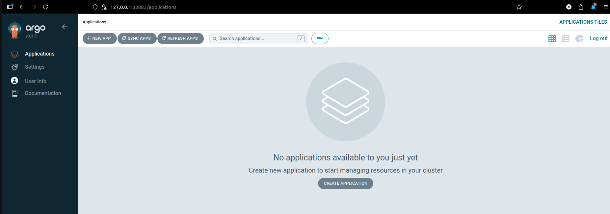
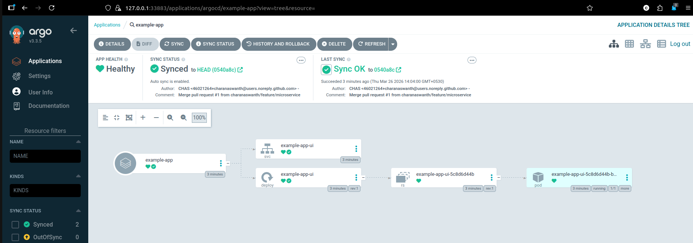
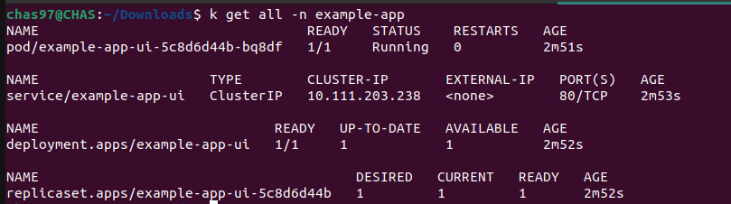
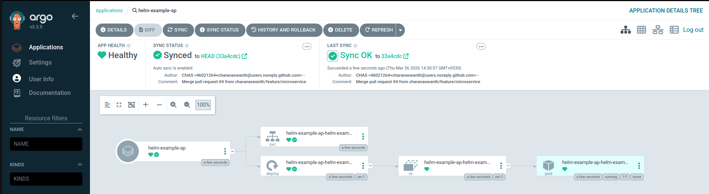
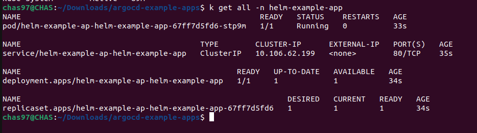
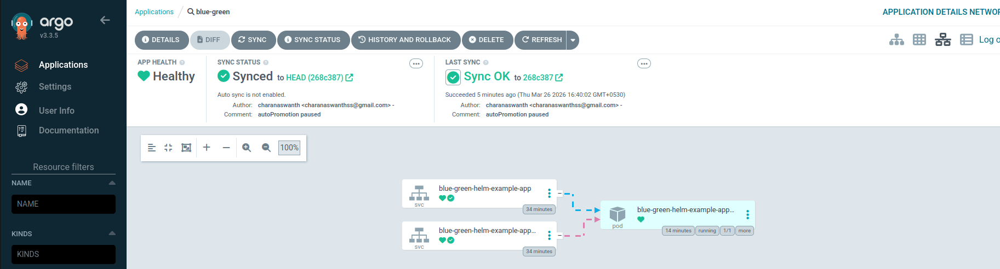

# GitOps- Argo CD

Argo CD is a declarative, GitOps continuous delivery tool for Kubernetes.
It automates application deployment by syncing the desired state defined in a Git repository with the actual state of a Kubernetes cluster. 
It supports various manifest formats like Helm and Kustomize.



ArgoCD considers the manifest files in the Git repository as source of truth and compares with the deployment state in Kubernetes. When any change made in Git repository, ArgoCD pulls the changes, compares the state and applies the changes in Kubernetes.

---

## Architecture


API Server - It exposes the API consuemed by UI. It supports authunetication and authorization.

Repo Server - It pulls the state from Git repository.

Application Controller - It is a kubernetes contoller which collects the current running deployment state in Kubernetes and compares it with the Git repository state. Then applies the changes if any mismatch found.

---

## Setup

1. Create namespace for argocd resources installation and apply the argocd manifest file.
```sh
kubectl create namespace argocd
kubectl apply -n argocd --server-side --force-conflicts -f https://raw.githubusercontent.com/argoproj/argo-cd/stable/manifests/install.yaml
```

2. In case of minikube, get the arogocd server service IP to login.
```sh
minikube service argocd-server -n argocd
```

3. Initial login credential is available inside argocd-initial-admin-secret secrets.
```sh
kubectl get secrets/argocd-initial-admin-secret -o yaml
echo "<secret>" | base64 --decode
 ```

 

---

> Refer: https://github.com/argoproj/argocd-example-apps

## Create application in ArgoCD

1. Select **New App**.
2. Update required details like **Application Name, Project, Git source URL and Namespace** details.
3. Once required details are updated click **Create**.
4. ArgoCD will start scanning the source and create resoures accordingly.




5. Try changing the replicas in git and later update deployment to scale down to check how argoCD keeps sync the state. (default sync time is 180s)

---

## Create Helm application in ArgoCD

1. Select **New App**.
2. Update required details like **Application Name, Project, Git source URL and Namespace** details.
3. ArgoCD will automatically detect the helm path and provide in the drop down.
4. Specify additional path of values.yaml if any required.
5. Once required details are updated click **Create**.
6. ArgoCD will start scanning the source and create resoures accordingly.




---

## BlueGreen Deployment

1. Argo Rollouts is a **Custom Resource Definition**, that is used for deployment strategies.
```sh
kubectl create namespace argo-rollouts
kubectl apply -n argo-rollouts -f https://github.com/argoproj/argo-rollouts/releases/latest/download/install.yaml
```
2. Supported delpoyment strategies are Canary, Blue-Green deployments, Automated promotion / rollback and Traffic shifting (with service mesh / ingress)
3. Create blue-green application in argoCD.
4. Update the image version. You will be seeing two pods and respective services blue and green connected to it.

5. Run below command to switch to the newer version. Older version will get deleted
```sh
argocd app patch-resource blue-green --kind Rollout --resource-name blue-green-helm-example-app --patch '{ "status": { "verifyingPreview": false } }' --patch-type 'application/merge-patch+json'
```


---