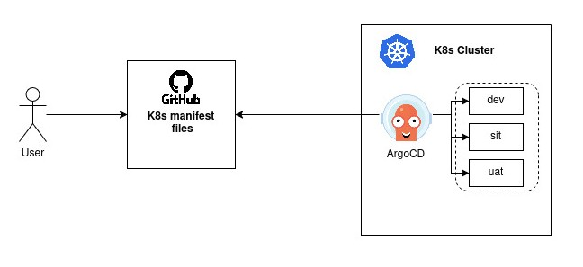

# GitOps- Argo CD

Argo CD is a declarative, GitOps continuous delivery tool for Kubernetes.
It automates application deployment by syncing the desired state defined in a Git repository with the actual state of a Kubernetes cluster. 
It supports various manifest formats like Helm and Kustomize.

