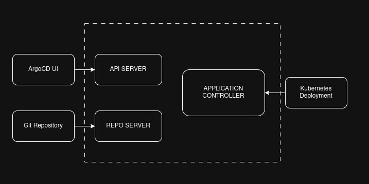

# GitOps- Argo CD

Argo CD is a declarative, GitOps continuous delivery tool for Kubernetes.
It automates application deployment by syncing the desired state defined in a Git repository with the actual state of a Kubernetes cluster. 
It supports various manifest formats like Helm and Kustomize.


ArgoCD considers the manifest files in the Git repository as source of truth and compares with the deployment state in Kubernetes. When any change made in Git repository, ArgoCD pulls the changes, compares the state and applies the changes in Kubernetes.


## Architecture



API Server - It exposes the API consuemed by UI. It supports authunetication and authorization.

Repo Server - It pulls the state from Git repository.

Application Controller - It is a kubernetes contoller which collects the current running deployment state in Kubernetes and compares it with the Git repository state. Then applies the changes if any mismatch found.

## Setup

1. Create namespace for argocd resources installation and apply the argocd manifest file.
```sh
kubectl create namespace argocd
kubectl apply -n argocd --server-side --force-conflicts -f https://raw.githubusercontent.com/argoproj/argo-cd/stable/manifests/install.yaml
```

2. In case of minikube, get the arogocd server service IP to login.
```sh
minikube service argocd-server -n argocd
```

3. Initial login credential is available inside argocd-initial-admin-secret secrets.
```sh
kubectl get secrets/argocd-initial-admin-secret -o yaml
echo "<secret>" | base64 --decode
 ```